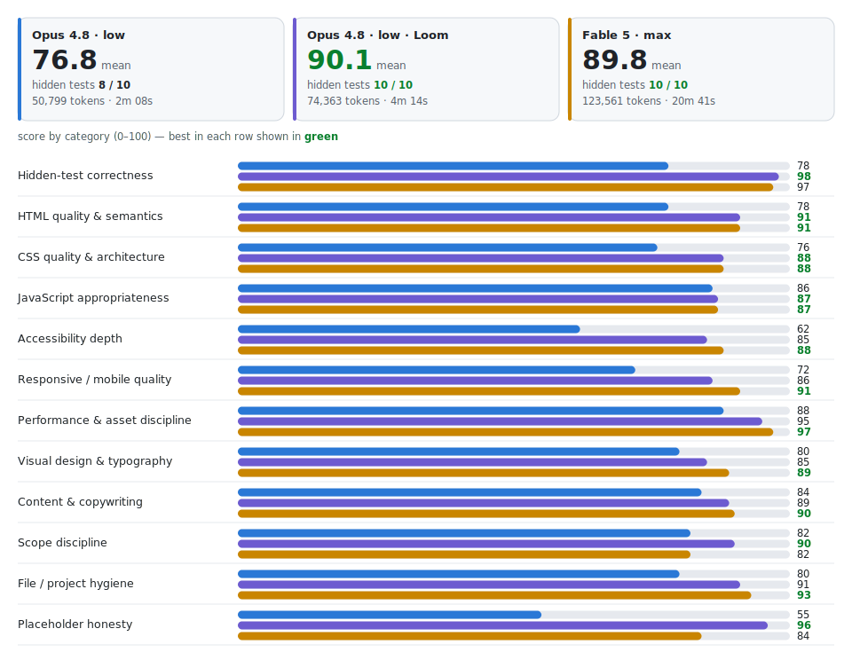

# Benchmark — does Loom change the output?

One brief, three isolated agent sessions, blind grading. This is the first Loom
benchmark; more will follow, on harder and more varied tasks. The result of this one is
below in full — costs, defects, and the places Loom did not lead included.

## The three configurations

Each session received the same one-line task and nothing else. The two Opus sessions
were given byte-identical instructions; the **only** difference between them was whether
the prompt invoked Loom.

| # | Model | Effort | Loom |
|---|---|---|---|
| 1 | Claude Opus 4.8 | low | — |
| 2 | Claude Opus 4.8 | low | **Loom** |
| 3 | Claude Fable 5 | max | — |

The task, verbatim:

> Build a landing page for a small neighborhood coffee shop called "Driftwood Coffee".
> (static files only, served as-is)

## The exact prompts

**Configurations 1 and 3 (no Loom)** received the same instruction:

```
Build a landing page for a small neighborhood coffee shop called "Driftwood Coffee".

Work entirely inside <working directory>. Static files only (it will be served as-is).
Do not use the Skill tool or any skill, plugin, or planning-system files — work directly,
with your own judgment only. When done, state what you built and any questions you would
have asked, then stop.
```

**Configuration 2 (Loom)** — identical but for the invocation and the skill pointer:

```
/loom Build a landing page for a small neighborhood coffee shop called "Driftwood Coffee".

Work entirely inside <working directory>. Static files only (it will be served as-is).
The /loom skill is at <path to the installed skill> — read it and follow it as the skill
it is. When done, state what you built and any questions you would have asked (or batched),
then stop.
```

## Method

- **Sealed acceptance tests.** Ten pass/fail checks (static integrity, name prominence,
  mobile usability, broken references, HTML validity, fabricated-claim check, third-party
  requests, accessibility floor, and more) were written and fixed before any session ran.
  No session saw them.
- **Blind, deliverable-only grading.** A separate evaluator session received the live
  pages under anonymous labels and was told nothing about what produced them. Every score
  cites file-and-line evidence or a computed value (WCAG contrast ratios, anchor/id
  cross-checks, per-asset HTTP status, DOM parse).
- **Verbatim deployment.** Each page is published exactly as its session built it — no
  fixes, no touch-ups. The links at the bottom are those artifacts.
- **Costs are the harness-reported totals** for each session. Nothing is estimated.

## Results

<picture>
  <source media="(prefers-color-scheme: dark)" srcset="assets/benchmark-dark.svg">
  
</picture>

Headline (higher is better except cost; **bold** = best):

| Metric | Opus 4.8 · low | Opus 4.8 · low · Loom | Fable 5 · max |
|---|---:|---:|---:|
| Sealed tests passed | 8 / 10 | **10 / 10** | **10 / 10** |
| Category mean (of 12) | 76.8 | **90.1** | 89.8 |
| Adversarial defects | 9 | **5** | 16 † |
| Tokens | 50,799 | 74,363 | 123,561 |
| Wall time | 2m 08s | 4m 14s | 20m 41s |

† The frontier-model page was assessed in a separate grading pass with its own severity
threshold, so its defect count is not directly comparable to the two Opus figures; the
category scores are on the same rubric.

Category scores, 0–100 (**bold** = best in row; shown in green in the chart above):

| Category | Opus 4.8 · low | Opus 4.8 · low · Loom | Fable 5 · max |
|---|---:|---:|---:|
| Hidden-test correctness | 78 | **98** | 97 |
| HTML quality & semantics | 78 | **91** | **91** |
| CSS quality & architecture | 76 | **88** | **88** |
| JavaScript appropriateness | 86 | **87** | **87** |
| Accessibility depth | 62 | 85 | **88** |
| Responsive / mobile quality | 72 | 86 | **91** |
| Performance & asset discipline | 88 | 95 | **97** |
| Visual design & typography | 80 | 85 | **89** |
| Content & copywriting | 84 | 89 | **90** |
| Scope discipline | 82 | **90** | 82 |
| File / project hygiene | 80 | 91 | **93** |
| Placeholder honesty | 55 | **96** | 84 |

## The result

**Claude Opus 4.8 at low effort, running Loom, scored 90.1 and passed all ten sealed
tests — matching the frontier model (Fable 5) at maximum effort while using about 60% of
its tokens and one-fifth of its wall time.** A 0.3-point margin between two different
models is a tie in craft; a tie between a small model with a method and the strongest
model thinking as hard as it can, reached roughly five times faster, is the entire case
for a planning system.

The same-model comparison is not a tie. Same model, same effort, same prompt, the only
change being the `/loom` invocation: **+13.3 mean points, ten sealed tests against eight,
five adversarial defects against nine, and zero medium-severity defects against two.**

## What the evaluator found

- **Without Loom, the Opus page shipped content that misleads a visitor:** two social
  links that resolve to nowhere, a press quote attributed to an invented publication and
  presented as a real endorsement, a realistic street address stated as fact, two
  computed WCAG AA contrast failures, and a third-party font preconnect that opens a
  connection it never uses.
- **With Loom, the same model shipped nothing broken and nothing dishonest:** every
  anchor resolves, zero external requests, every placeholder announces itself while
  staying in voice, all contrast pairs pass AA, and a keyboard skip link with a visible
  focus state is present. Both pages invented the same amount of scope; the difference
  was finish.
- **The frontier model produced an excellent page** — leading on accessibility depth,
  responsive build, and performance — and still shipped the benchmark's most instructive
  defect: a newsletter form that told visitors they were subscribed while storing
  nothing, and a tagline promising hours its own schedule contradicted.

Across all three, the worst defects were failures of truthfulness rather than
engineering. That is the failure class Loom's discipline is built around, which is why
the Loom configuration's placeholder-honesty and correctness scores are the load-bearing
numbers in the table, not incidental ones.

## Caveats

- **One run per configuration.** Single runs of a stochastic system are directional, not
  proof. A repeated-run benchmark is the next step.
- **One task family** — a static landing page. Whether the effect holds for applications,
  CLIs, and APIs is untested, and is what later benchmarks will measure.
- Configuration 3 versus the others is a cross-model comparison, not a controlled
  ablation. Configurations 1 and 2 **are** a controlled ablation — only the `/loom`
  invocation differs.
- The evaluator is a language-model session: blind, evidence-cited, and machine-checked
  where possible, but not a human judge.

## Reproduce it

Write your acceptance tests before any session runs, keep the building sessions unaware,
grade blind against the deliverables only, and report the costs even when they are
unflattering. The deployed pages, exactly as built:

- **Opus 4.8 · low** — https://saroo98.github.io/bench-opus-low/
- **Opus 4.8 · low · Loom** — https://saroo98.github.io/bench-opus-low-loom/
- **Fable 5 · max** — https://saroo98.github.io/bench-fable-max/
