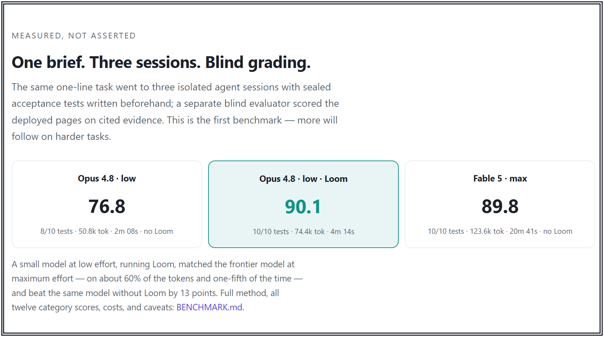

<picture>
  <source media="(prefers-color-scheme: dark)" srcset="assets/banner-dark.svg">
  
</picture>

<div align="center">
  
  
  
  <br>
  <a href="https://github.com/saroo98/loom/actions/workflows/verify.yml"></a>
</div>

<h3 align="center">Loom is alive. It shows its work. It learns from every run — and the more you work with it, the better it gets.</h3>

<p align="center"><b>On a smaller model at low effort, Loom matched a frontier model
running at maximum effort — using fewer tokens and less time.</b> The most rigorous
planning system an AI coding agent can run, behind the shortest command you'll type
today. (<a href="https://saroo98.github.io/loom/">website</a>)</p>

<a href="BENCHMARK.md">
<picture>
  <source media="(prefers-color-scheme: dark)" srcset="assets/benchmark-dark.svg">
  
</picture>
</a>

<p align="center"><sub>First benchmark — one brief, three isolated sessions, sealed
hidden tests. Built and scored blind by <b>Claude Fable 5 at maximum effort in an
isolated environment</b>; deliverables graded on cited evidence. Full method, all twelve
category scores, costs, and caveats: <a href="BENCHMARK.md">BENCHMARK.md</a>.</sub></p>

Loom is a planning operating system for AI agents. Underneath: truth-labeled plans, an
assumption ledger with break propagation, review gates, atomic work orders, drift
detection, a multi-agent concurrency protocol, and an outcome record that audits the
plan's own predictions. On the surface: you type `/loom` and describe what you want.
That asymmetry is the entire design — the machinery is heavy so your hand never is.

No runtime. No server. No account. Markdown guidance plus small standard-library Python
tools, in a git repo you own outright.

## It starts small and it compounds

<picture>
  <source media="(prefers-color-scheme: dark)" srcset="assets/growth-dark.svg">
  
</picture>

Day one, Loom already plans better than an unstructured agent — that part is table
stakes. The part nobody else ships: **every run feeds it.** Outcomes get checked against
predictions. Mistakes become FEEDBACK entries that change the guidance itself.
Calibration data accumulates — which estimates run hot, which assumptions break, which
question styles you actually answer. Your `~/.loom/` learns your defaults; your Loom
grows deep-dives for *your* domains.

Give it a year of real projects and you're holding a planning system fitted to your
stacks, your languages, your failure patterns — one that no shelf, no marketplace, and
no amount of stars can ship to anyone else, because it grew inside your work. The
ceiling isn't our roadmap. It's your usage.

**The more you work with it, the better it gets.**

## Three commitments most tools don't make

1. **It labels what it doesn't know.** Every load-bearing claim carries one of five
   labels. Every `[ASSUMPTION]` lives in a ledger with `risk_if_wrong` and `verify_by` —
   and when one breaks, everything built on it gets flagged, mechanically.
2. **It notices when the world moves.** Packs carry freshness stamps and repo-head
   anchors; a 25+ check linter catches drift, cycles, unverifiable acceptance criteria,
   secrets, hedge-words, oversized work orders, and criteria resting on facts the same
   work order admits are unverified — before any gate spends judgment on them.
3. **It answers to evidence, including about itself.** Loom ships the falsifiable
   scorecard it must pass to call itself 1.0 — and a standing rule that no Loom may
   score itself. A fresh install starts unproven *on purpose*.

## The lifecycle

<picture>
  <source media="(prefers-color-scheme: dark)" srcset="assets/lifecycle-dark.svg">
  
</picture>

The loop closes. That last node — *Learn* — is what separates a planning system from a
planning ritual: gates and ledgers keep single runs honest; the loop makes run *n+1*
better than run *n*.

## Quickstart — three commands, then one

```bash
git clone <this-repo-or-your-copy> loom
cd loom
tools/install.sh          # macOS/Linux — Windows: tools\install.ps1
```

The installer registers `/loom` for Claude Code and Codex (any skills-capable harness
works — the whole skill is one markdown file: `skill/loom/SKILL.md`).

Then, in any project conversation, tell it four things: **a name, one sentence, what
"done" looks like, and your hard limits.** Like this:

```
/loom plan — recipe-box: a web app where my mom saves and searches her recipes.
For: one non-technical user, on her phone. Done = she adds a recipe and finds it
by ingredient, live on a real URL. Constraints: free hosting only. Repo: none.
```

That one message is a complete brief. Loom takes it from there: surveys the repo if one
exists, interrogates what you *didn't* say (the silence sweep), writes the plan pack
into `<project>/plans/`, gates it against the rubric, and comes back with **one** batched
set of decisions — each with a recommendation, so a one-word reply unblocks everything.

And the structure is optional. No name, no "Done =", no format at all — just talk:

```
/loom I keep losing track of the invoices for my freelance work, build me
something small that fixes that
```

Loom infers the mode, the tier, and the finish line itself, labels every guess it had
to make, and asks you at most one batched question. Small task? `/loom small` skips the
ceremony — one work order, two checks. Right-sizing is enforced, not aspirational.

| Moment | Command |
|---|---|
| Plan a project or feature | `/loom plan <description>` |
| Small task, zero ceremony | `/loom small <task>` |
| Execute a work order | `/loom wo WO-003` |
| Back after a break / repo moved | `/loom resume` |
| See the whole pack as one page | `/loom report` |
| Mechanical health check | `/loom lint` |
| Gate a milestone | `/loom gate G4` |
| Review a pack you didn't write | `/loom review <pack>` |
| Teach it a preference | `/loom profile set <key> <value>` — or just say "remember that I…" |
| Everything, inferred | bare `/loom` — picks the mode, closes with retro automatically |

## The five labels

<picture>
  <source media="(prefers-color-scheme: dark)" srcset="assets/labels-dark.svg">
  
</picture>

Missing information never stalls a plan — it becomes a labeled assumption with a
verification deadline. Silent guessing on irreversible choices is forbidden — that's
what `[HUMAN-DECISION]` is for, batched so you answer once per gate, not once per
question.

## Sovereign by architecture

Your Loom answers to you and to no one else — and that's structural, not a policy
promise:

- **Nothing leaves your machine.** The learning loop writes to your `~/.loom/` and your
  Loom repo's FEEDBACK queue. No central queue, no upstream channel, no telemetry — the
  channel *does not exist*. Don't take that on faith — audit it in one command:
  `python tools/loom_audit.py` (AST-level scan: no network-capable imports anywhere,
  subprocess restricted to git and the test runner; exit 0 = pass). The same audit runs
  publicly on every push to this repository, so the proof trail is generated in the
  open, not asserted by the author.
- **Every install is sovereign.** Your Loom triages its own feedback, grows its own
  chapters, diverges from every other install — by design.
- **Upstream is optional.** Releases of this repo are imports you may cherry-pick,
  never updates you owe anyone. Divergence is success.

Details: [`PRIVACY.md`](PRIVACY.md) · [`CONTRIBUTING.md`](CONTRIBUTING.md) ·
[`loom/core/privacy.md`](loom/core/privacy.md)

## Discipline you can diff

Nothing here runs on trust. The mechanical fraction is enforced by `loom_lint` (gates
refuse to open on errors; a pre-commit guard blocks defective packs at commit time).
The judgment fraction is enforced by gates that demand a review file with cited scores —
by a session that didn't write the plan, when the harness can spawn one. The honesty
fraction is enforced by outcome ledgers: predictions in writing, checked against
reality, kept even when they're embarrassing. Especially then.

## FAQ

**Does anything get sent anywhere?** No — see the grep above. Architecture, not policy.

**Do my lessons improve this upstream repo?** No. Your retro feeds *your* Loom. That's
the point.

**Which agents does it work with?** Installers ship for Claude Code and Codex. Any
harness that can follow a markdown skill can run it.

**What if my project repo is public?** Handled: packs live outside public repos or in
verified-ignored directories, and lint scans for secrets and identifying tokens on
every run.

**Is this a framework I have to adopt?** It's files. The artifact matrix exists
precisely so you produce only what has a consumer; tier-S work skips the pack entirely.

**Can I publish my own Loom?** Yes — `tools/loom_publish.py` builds a leak-firewalled
public cut of your instance, the same way this repository was made.

## License

Apache-2.0 — see [`LICENSE`](LICENSE).
