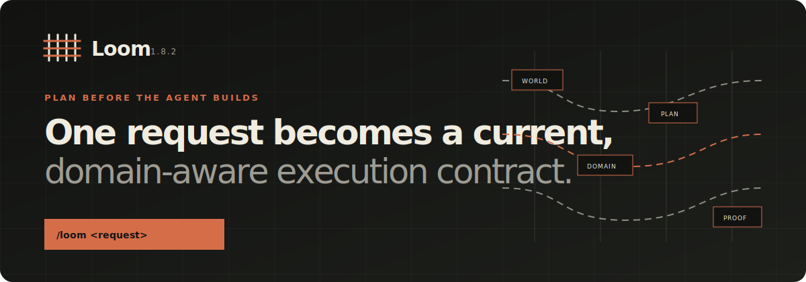

<p align="center">
  <a href="https://saroo98.github.io/loom/">
    
  </a>
</p>

<p align="center">
<strong>Loom 1.8.6 · Planning intelligence for AI coding agents.</strong><br>
  Plan from the current world. Verify in the real one.
</p>

<p align="center">
  <a href="https://saroo98.github.io/loom/">Website</a> ·
  <a href="https://github.com/saroo98/loom/releases/tag/v1.8.5">Latest release</a> ·
  <a href="#install">Install</a> ·
  <a href="#what-happens-after-one-request">How it works</a> ·
  <a href="#how-learning-works">Learning</a> ·
  <a href="#evidence-and-current-limits">Evidence</a>
</p>

---

## What Loom is

Loom is a planning runtime for AI coding agents.

You describe the work once:

```text
/loom <request>
```

Loom resolves the real project, fingerprints its current state, chooses the planning depth, applies
the domain's rules, selects only relevant owner memory, seals the plan before implementation, and
defines how the result must be verified.

The output is not a longer prompt. It is an execution contract that can be reviewed, become stale,
or be refused.

Loom is not another coding agent, a project board, or a template collection. It sits between what a
person asks for and what an agent is allowed to build.

## What changed in 1.8.6

Loom 1.8.6 makes the native Codex path complete and repeatable without weakening its sealed
request boundary:

- **The agent receives the whole public planning frontier.** Bounded hook context now carries the
  request, current-world evidence, plan contract, and required outcome needed to author real plan
  artifacts. Private encrypted action state remains private.
- **Retries follow operations, not merely words.** A duplicate delivery in an unchanged world is
  idempotent. The same natural-language request after repository or lifecycle advancement creates
  the next operation or fails closed instead of replaying stale authorization.
- **Non-Git projects retain completion identity.** Stable initial-pack evidence prevents valid
  repair or execution completion from becoming unverifiable merely because a project has no Git
  commit.
- **CI spends exhaustive effort once.** Required pull-request gates protect `main`; the full
  15-cell release matrix runs on the merged candidate used by exact-cut certification.

The most recent published signed artifact remains `v1.8.5` until the `v1.8.6` candidate is
committed, attested, and published from `main`.

## What changed in 1.8.5

Loom 1.8.5 gives Codex a native sealed invocation path without exposing request text to a shell,
command line, environment variable, or temporary file:

- **Codex can invoke Loom itself.** A trusted `UserPromptSubmit` hook receives explicit `/loom`
  requests as bounded JSON on stdin and injects the sealed Loom receipt before agent work begins.
- **Request identity survives intact.** Multiline text, Unicode, whitespace, quotes, and shell
  metacharacters remain inside protocol-v2 JSON across both process boundaries.
- **Ordinary prompts remain ordinary.** The hook is silent and creates no Loom state unless the
  user explicitly invokes `/loom` or the Loom skill.
- **Global installation no longer looks like split brain.** A user-global Loom skill at the owner
  home boundary is not misclassified as a project-local shadow, while genuine local conflicts
  still fail closed.

The signed `v1.8.5` release is bound to commit
[`2f5a85f7335aa7b4d75f298ca9c1df8d3f46078d`](https://github.com/saroo98/loom/commit/2f5a85f7335aa7b4d75f298ca9c1df8d3f46078d).
Its installable plugin archive has SHA-256
`8c4c2595eff776728686cad8cdbfbf00a3fc2f58ca3f10b3857fce102c7332a7`.

## What changed in 1.8.4

Loom 1.8.4 hardens the control plane that decides whether work may continue:

- **Recovery is transactional.** Interrupted cancellation records the source, quarantine, and
  absence state consistently across same-volume and cross-volume filesystems. Malformed,
  contradictory, or unsupported recovery receipts fail closed.
- **A repeated request means the right thing.** Retrying the same request in an unchanged world is
  idempotent. Repeating it after the repository or lifecycle advances creates the next operation
  instead of replaying a stale sealed receipt.
- **Verification-only work stays honest.** Loom can verify implementation that predates the current
  lifecycle without claiming that the new plan caused the old work.
- **Release evidence comes from the final tree.** Generated inventory is refreshed after the last
  test is added, so published counts cannot silently lag behind the release being described.

The signed `v1.8.4` release is bound to commit
[`d8f552606d64fcf2936cb4a3958a294af4ac87f2`](https://github.com/saroo98/loom/commit/d8f552606d64fcf2936cb4a3958a294af4ac87f2).
Its installable plugin archive has SHA-256
`34678cd745e4e7a5557da44d187b9f68f5b3cc50f7fd4cdb05730c01befdfcfa`.

## Install

Requirements: Python 3.10 or newer and a clean checkout. A direct source install also needs Rust
with the locked dependencies available offline unless the install already contains the native
helper for the current platform.

```powershell
git clone https://github.com/saroo98/loom.git
cd loom
python tools/loom_install.py install . "$HOME/.codex/skills/loom"
```

Then open a project and ask for the work you want:

```text
/loom Migrate local authentication to passkeys without locking out existing users.
```

Check the installed copy at any time:

```powershell
python tools/loom_install.py check "$HOME/.codex/skills/loom"
```

The installer writes only to a new target, hashes every owned file, records an installation
identity, and verifies the copy. Removal is all-or-nothing: if an owned file changed, Loom refuses
to delete it.

On first use, the installed skill verifies that receipt and activates the stable launcher. This
local path is labeled `direct-source-install-unattested`; it proves byte ownership, not publisher
identity. Signed packages remain a separate authority and never fall back to this mode when signed
metadata is incomplete.

This repository is directly installable. A public Codex marketplace listing is not claimed until
submission and approval actually happen.

For the verified release artifact, download `loom-plugin-v1.8.5.zip` from
[the v1.8.5 release](https://github.com/saroo98/loom/releases/tag/v1.8.5), verify it before
installation, and retain the prior runtime until the new version has passed its bootstrap checks.

## What happens after one request

| Stage | Loom decides | What this prevents |
|---|---|---|
| Resolve | Which project, installation, lifecycle, and authority are real | Planning the wrong folder or Loom instance |
| Survey | What is committed, staged, unstaged, untracked, policy-proven generated, unresolved, or time-drifted | A plan based on silent truncation or a guessed generated folder |
| Route | Whether the work is S, M, L, or XL from consequence and uncertainty | Spending a migration-sized process on a typo, or a typo-sized process on a migration |
| Discover | Which domain invariants, current facts, and proof medium apply | Web-shaped planning in accounting, 3D, firmware, research, or an unknown field |
| Seal | Which artifacts, work orders, touched paths, gate records, and evidence are authorized | Implementation changing the plan after approval |
| Verify | Which real-medium checks must pass before completion | “Looks good” or a host-authored status replacing evidence |

The owner sees one command. The machinery stays behind it.

## Small work stays small

A small, low-consequence change receives one compact contract and one bounded work order. Loom has
hard Tier-S budgets and automatically promotes the task when uncertainty, scope, domain coverage,
or consequence makes the small path unsafe.

Examples:

| Request | Route | Planning result |
|---|---|---|
| Fix a CSV header typo | S | Current file state, one compact work order, one targeted real check |
| Replace local auth with passkeys | L | Architecture, security, migration, rollback, testing, rollout, and recovery plans |
| Plan a laboratory calibration procedure | Promoted | Domain discovery first; authorization stays blocked until authority and proof apply |

No extra document is produced merely because a template exists. Loom accounts for all 15 candidate
artifacts. Each one is either produced for a named consumer making a named decision, or skipped with
a reason.

## The useful part is what Loom refuses

Loom fails closed when trust-critical state is unknown.

| If this happens | Loom does this | Reason |
|---|---|---|
| The repository changes during planning | Blocks G1 | The plan no longer describes the same world |
| Domain authority or a current governing fact is missing | Discovers and re-gates | Generic defaults cannot stand in for domain truth |
| The work-order plan changes after approval | Refuses execution | Approval belongs to exact content, not a filename |
| A deliverable already existed before planning | Refuses causal plan credit | Planning cannot take credit for build-first work |
| No declared target changed | Refuses completion | A no-op is not an implemented work order |
| Real-medium evidence is absent | Refuses completion | A written “passed” flag is not proof |
| A repo-local adapter conflicts with the shared runtime | Refuses split-brain operation | One request must reach one runtime and one state authority |

## Domain-aware does not mean “knows everything”

Loom ships adapters for known domains and a separate discovery gate for unknown ones.

An accounting plan can require balanced postings, currency precision, reconciliation, audit trails,
and period-close behavior. A real-time 3D plan can require coordinate-system discipline, asset
provenance, spatial interaction states, frame-time budgets, and target-device profiling. Firmware
can require timing, power, interrupt, recovery, and hardware-in-loop evidence. Research can require
source quality, method, uncertainty, and reproducibility.

When Loom does not know a domain, it says so. It identifies the affected subsystem, finds governing
invariants and current facts, records contradictions, defines a real verification medium, and keeps
the execution gate closed until the evidence is applicable and fresh.

The deterministic domain benchmark is regression evidence. It is not proof that Loom knows every
field.

## How learning works

Loom's memory is not one growing prompt.

| Scope | What belongs there | When it loads |
|---|---|---|
| General | Calibration, decision batching, review preferences, and judgment that has earned transfer | Across projects when evidence supports transfer |
| Domain | Accounting, 3D, firmware, mobile, data, or other domain rules | Only for matching domain work |
| Project | Repository facts, decisions, outcomes, and local preferences | Only for the exact project lineage |
| Installation | Device/runtime state and adapter ownership | Only inside that installation boundary |

Learning admission is evidence-based. Loom records where a candidate came from, whether it helped or
hurt, confidence, utility, scope, and future use. Active context remains capped at 16 records and
8 KB.

When a domain stops being useful, its active records become dormant. They can return for the exact
domain or expire when utility and evidence no longer justify keeping them. Project facts archive
with the project. A durable forget operation erases content and keeps only the bounded deletion
commitment needed to stop an old device or backup from resurrecting it.

Counts do not become “improvement.” Loom reports measured benefit only when a valid comparison
design and evidence support it.

## Privacy is a build property

Loom is local-first and has no Loom telemetry.

The public builder:

- starts from a positive allowlist;
- scans every filename and every file byte;
- checks text and binary content for owner tokens and secret signatures;
- rejects redirected files, unsupported opaque containers, and dangerous paths;
- emits a content-bound build manifest;
- refuses publication when a claimed protection would protect nothing.

Owner memory, project content, credentials, transcripts, local paths, and executable private
adaptations are not public-release material.

Read the exact boundary in [PRIVACY.md](./PRIVACY.md).

## Evidence and current limits

Loom separates source inventory, local behavior, real-host evidence, provider receipts,
longitudinal outcomes, independent review, and public adoption. One class cannot silently stand in
for another.

Current records:

- [Capability registry](./docs/capabilities.json): each mechanical claim names enforcement code and tests.
- [Start with Loom](./docs/start.md): the shortest path from installation to one safe request.
- [Operational lifecycle](./docs/operations.md): update, rollback, uninstall, and conflict behavior.
- [Release readiness](./docs/release-readiness.md): generated statuses with missing proof left visible.
- [Private diagnostics](./docs/support-bundles.md): body-free health and encrypted local support export.
- [Generated repository inventory](./docs/generated-evidence.json): live counts, explicitly not a test-pass claim.
- [Competitive evidence snapshot](./benchmarks/competitive/2026-07-17/README.md): one rubric, exact peer revisions, N/A normalization, and visible **[UNVERIFIED]** cells.
- [Current limitations](./docs/limitations.md): proof Loom does not yet have.
- [Unknown-domain contract](./docs/unknown-domain-intelligence.md): what the discovery gate proves and does not prove.
- [Planning-intelligence contract](./docs/planning-intelligence.md): bounded specialist atoms, source-material isolation, and lifecycle rules.
- [Simple adaptive experience](./docs/simple-adaptive-experience.md): the sealed two-line owner
  message, deterministic continuation authority, proportional effort, exact cache invalidation,
  and bounded self-cleaning learning behind `/loom`.

Loom does not claim a perfect score or production certification. Those require a complete hosted
platform matrix, real disposable host runs, provider-native token and latency measurements,
independent unfamiliar-user and hostile audits, and measured longitudinal owner benefit against
the exact release.

## Architecture in one view

```text
/loom <request>
       |
       v
project identity + complete world fingerprint
       |
       +---- relevant owner memory (bounded by scope)
       |
       +---- domain route
                |
                +---- known: apply exact invariants
                |
                +---- unknown: discover authority, facts, conflicts, proof
       |
       v
content-bound plan contract
       |
       v
independent G1 gate -> atomic work orders -> real-medium verification
       |
       v
compact receipt + scoped outcome evidence
```

Start with:

| File | Purpose |
|---|---|
| [START-HERE.md](./START-HERE.md) | Compact agent kernel |
| [skill/loom/SKILL.md](./skill/loom/SKILL.md) | One-command bridge |
| [docs/architecture.md](./docs/architecture.md) | Runtime, state, memory, adapter, and release architecture |
| [loom/intake/artifact-matrix.md](./loom/intake/artifact-matrix.md) | Consumer-driven artifact selection |
| [loom/core/epistemics.md](./loom/core/epistemics.md) | Fact, assumption, speculation, unknown, and decision rules |
| [CONTRIBUTING.md](./CONTRIBUTING.md) | Public contribution and verification procedure |

## Verify this source

```powershell
python -B tools/loom_release.py verify . --source-classification public-release
```

This runs the release suite, adaptation scenarios, all-file privacy firewall, offline audit,
reproducibility checks, installer cycle, performance contracts, documentation audit, and bounded
longitudinal checks.

Local verification is necessary. It is not independent certification.

The installable artifact is `loom-plugin-vX.Y.Z.zip`, not GitHub's generated source archive.
Verify its receipt-bound bytes before installation:

```powershell
python -B tools/loom_release_verify.py loom-plugin-vX.Y.Z.zip
```

---

<p align="center">
  <strong>Plan from the current world. Verify in the real one.</strong><br>
  Local-first · no telemetry · standard-library Python · Apache-2.0
</p>
