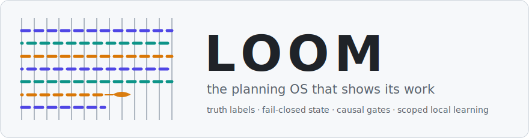
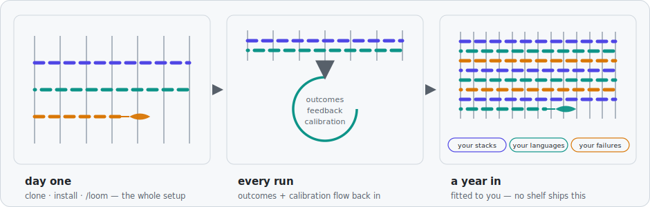
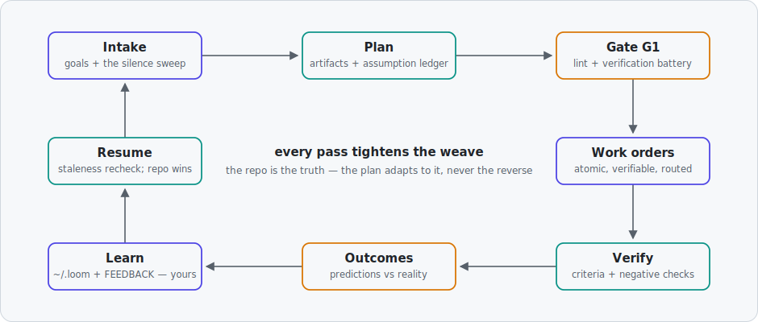

<picture>
  <source media="(prefers-color-scheme: dark)" srcset="assets/banner-dark.svg">
  
</picture>

<div align="center">
  
  
  
</div>

<h3 align="center">Loom shows its work, fails closed on unknown state, and measures whether owner calibration improves.</h3>

<p align="center"><b>In one same-model landing-page comparison, the Loom-invoked artifact
scored 90.1 vs 76.8 and passed 10/10 vs 8/10 sealed checks.</b> n=1, one web task, and the
pack/G1 was retrospective. Complete B2 response usage was 1,278,126 processed token events,
not the previously advertised 74,363 subset. <a href="BENCHMARK.md">Corrected record.</a></p>

Loom is a planning operating system for AI agents. Underneath: truth-labeled plans, an
assumption ledger with break propagation, review gates, atomic work orders, drift
detection, a multi-agent concurrency protocol, and an outcome record that audits the
plan's own predictions. On the surface: you type `/loom` and describe what you want.
That asymmetry is the entire design — the machinery is heavy so your hand never is.

No runtime. No server. No account. Markdown guidance plus small standard-library Python
tools, in a git repo you own outright.

## It starts small and it compounds

<picture>
  <source media="(prefers-color-scheme: dark)" srcset="assets/growth-dark.svg">
  
</picture>

Day one supplies explicit epistemics, state checks, atomic work orders, and gates. At retro,
consequential numeric predictions can be recorded against outcomes. Typed stated preferences
and exact matched-domain/project observations load through one hard context cap; raw history
and unmatched domains do not.

`loom_memory report` compares early and recent error for one required metric and one exact
domain (`general` by default). Loom calls this improvement only when recent measured error is
lower; accumulating rows alone is not improvement. Active memory,
outcomes, and contribution queues all have hard bounds.

## Three commitments most tools don't make

1. **It labels what it doesn't know.** Every load-bearing claim carries one of five
   labels. Every `[ASSUMPTION]` lives in a ledger with `risk_if_wrong` and `verify_by` —
   and when one breaks, everything built on it gets flagged, mechanically.
2. **It notices when the world moves.** Packs carry freshness stamps and repo-head
   anchors; the linter catches drift, cycles, unverifiable acceptance criteria,
   secrets, hedge-words, oversized work orders, and criteria resting on facts the same
   work order admits are unverified — before any gate spends judgment on them.
3. **It answers to evidence, including about itself.** Loom ships the falsifiable
   scorecard it must pass to call itself 1.0 — and a standing rule that no Loom may
   score itself. A fresh install starts unproven *on purpose*.

## The lifecycle

<picture>
  <source media="(prefers-color-scheme: dark)" srcset="assets/lifecycle-dark.svg">
  
</picture>

The loop closes. That last node records scoped evidence; gates and ledgers keep single runs
honest, and the calibration report tests whether recent error is actually lower than early
error. No improvement is claimed from accumulation alone.

## Quickstart — three commands, then one

Requires CPython 3.11–3.13. The verification workflow is configured for Windows, Linux, and
macOS at Python 3.11 and 3.13.

```bash
git clone <this-repo-or-your-copy> loom
cd loom
tools/install.sh          # macOS/Linux — Windows: tools\install.ps1
tools/install.sh --check  # Windows: tools\install.ps1 -Check
```

The installer registers `/loom` for Claude Code and Codex (any skills-capable harness
works — the whole skill is one markdown file: `skill/loom/SKILL.md`).

Then, in any project conversation, tell it four things: **a name, one sentence, what
"done" looks like, and your hard limits.** Like this:

```
/loom plan — recipe-box: a web app where my mom saves and searches her recipes.
For: one non-technical user, on her phone. Done = she adds a recipe and finds it
by ingredient, live on a real URL. Constraints: free hosting only. Repo: none.
```

That one message is a complete brief. Loom takes it from there: surveys the repo if one
exists, interrogates what you *didn't* say (the silence sweep), writes the plan pack
into `<project>/plans/`, gates it against the rubric, and batches the current decision set —
each with a recommendation. This is the interaction policy, not a measured round-trip guarantee.

And the structure is optional. No name, no "Done =", no format at all — just talk:

```
/loom I keep losing track of the invoices for my freelance work, build me
something small that fixes that
```

Loom infers the mode, tier, and finish line and labels every guess it had to make. Intake policy
permits at most one batched question before the next gate; unresolved irreversible forks still
block. Small task? `/loom small` loads a bounded compact kernel, produces
one standalone work order, and uses a baseline/authorize/close hash chain—no pack or G1.

Measure the fixed source load instead of estimating it: `python tools/loom_context.py
session-tier-s-core --json` (or `session-tier-mplus`). It reports exact UTF-8 bytes, Unicode
characters, lines, and file hashes; tokenizer and provider-cache totals remain `null` unless a
real harness reports them. Route-dependent project/guidance context is explicitly excluded.

| Moment | Command |
|---|---|
| Plan a project or feature | `/loom plan <description>` |
| Small task, zero ceremony | `/loom small <task>` |
| Execute a work order | `/loom wo WO-003` |
| Back after a break / repo moved | `/loom resume` |
| See the whole pack as one page | `/loom report` |
| Mechanical health check | `/loom lint` |
| Gate a milestone | `/loom gate G4` |
| Review a pack you didn't write | `/loom review <pack>` |
| Teach it a preference | `/loom profile set <key> <value>` — or just say "remember that I…" |
| Everything, inferred | bare `/loom` — picks the mode, closes with retro automatically |

## The five labels

<picture>
  <source media="(prefers-color-scheme: dark)" srcset="assets/labels-dark.svg">
  
</picture>

Ordinary missing product information becomes a labeled assumption with a verification
deadline. Unknown freshness, privacy ownership, domain invariants, or irreversible authority
blocks the dependent action. Silent guessing on irreversible choices is forbidden.

## Sovereign by architecture

Your Loom answers to you and to no one else — and that's structural, not a policy
promise:

- **Memory commands are local and instance-bound.** They use local standard-library file IO;
  contribution is explicit and refuses another install UUID. `python tools/loom_audit.py`
  recursively checks shipped Python, shell/workflow, browser-executable, and rendered-Markdown
  surfaces for its declared network/process patterns. Git is the owner-requested synchronization
  exception. The audit does not inspect the host agent, editor, OS, or unknown patterns.
- **Every install is sovereign.** Your Loom triages its own feedback, grows its own
  chapters, diverges from every other install — by design.
- **Upstream is optional.** Releases of this repo are imports you may cherry-pick,
  never updates you owe anyone. Divergence is success.

Details: [`PRIVACY.md`](PRIVACY.md) · [`CONTRIBUTING.md`](CONTRIBUTING.md) ·
[`loom/core/privacy.md`](loom/core/privacy.md)

## Discipline you can diff

The parts called mechanical are enforced by `loom_lint` and `loom_gate` (gates
refuse to open on errors; a pre-commit guard blocks defective packs at commit time).
The judgment fraction is enforced by gates that demand a review file with cited scores —
by a session that didn't write the plan, when the harness can spawn one. The honesty
fraction is enforced by outcome ledgers: predictions in writing, checked against
reality, kept even when they're embarrassing. Especially then.

## FAQ

**Does Loom memory send anything?** No network path exists in `loom_memory.py`; contribution
is a same-install local file operation. Git or the host agent may use network only when you
explicitly direct them; `PRIVACY.md` states the source audit's exact scope.

**Do my lessons improve this upstream repo?** No. Your retro feeds *your* Loom. That's
the point.

**Which agents does it work with?** Installers ship for Claude Code and Codex. Any
harness that can follow a markdown skill can run it.

**What if my project repo is public?** Keep packs outside public repos or in verified-ignored
directories. Lint checks implemented secret/path/host shapes; publishing additionally uses a
positive allowlist, configured owner tokens, whole-output UTF-8 scan, and semantic human review.

**Is this a framework I have to adopt?** It's files. The artifact matrix exists
precisely so you produce only what has a consumer; tier-S work skips the pack entirely.

**Can I publish my own Loom?** Yes — `tools/loom_publish.py` builds a leak-firewalled
public cut of your instance, the same way this repository was made.

## License

Apache-2.0 — see [`LICENSE`](LICENSE).
