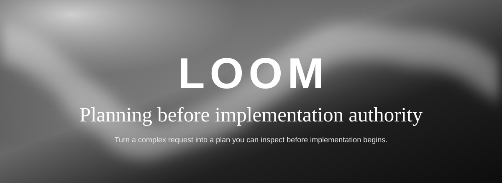
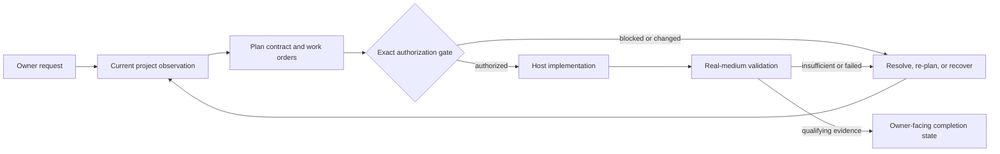

<p align="center">
  <a href="https://saroo98.github.io/loom/">
    
  </a>
</p>

<p align="center">
  <strong>Planning and verification control for AI coding agents.</strong><br>
  One request becomes bounded work that must remain tied to the world it was planned against.
</p>

<p align="center">
  <a href="https://saroo98.github.io/loom/">Website</a> ·
  <a href="#quick-start">Quick start</a> ·
  <a href="#installation">Installation</a> ·
  <a href="./docs/roadmap-v3.md">Roadmap v3</a> ·
  <a href="./docs/limitations.md">Limitations</a>
</p>

---

## What Loom is

Loom is a local-first planning and verification control layer for AI coding agents. It inspects the
current project, makes uncertainty explicit, produces a bounded plan and work orders, separates
planning from implementation authority, and represents the evidence required before completion.

Loom is not a coding model, a general autonomous executor, or a guarantee that an implementation is
correct. The coding host still performs the work. Loom defines and checks the lifecycle around that
work.

The owner-facing request surface is:

```text
/loom <request>
```

## Why Loom exists

A prompt rarely contains the complete working world. The repository may have uncommitted changes,
local instructions, architectural constraints, domain rules, unresolved decisions, and validation
that only makes sense in the real runtime.

Without an explicit control layer, an agent can produce a plausible plan for stale state, treat the
plan as permission to act, and call a green status “complete” without proving the requested
outcome. Loom is designed to keep those states separate and reviewable.

## Principal capabilities

Where the repository contains an implementation and tests, Loom can:

- inspect committed, staged, unstaged, and untracked project state as one bounded world;
- distinguish facts, assumptions, unknowns, contradictions, and human decisions;
- scale planning depth with consequence, uncertainty, scope, and domain coverage;
- produce consumer-driven planning artifacts and bounded work orders;
- bind authorization to exact plan content and a pre-implementation baseline;
- require declared real-medium evidence before completion;
- represent blocking conditions, recovery, retries, cancellation, and reversibility;
- keep general, domain, project, component, temporary, device, and installation state separate;
- build a public release from an allowlist and scan the resulting files for private material; and
- verify installation ownership, updates, rollback, and removal through explicit receipts.

These are implementation capabilities, not universal support or reliability claims. Exact status
and missing evidence are recorded in
[`docs/capabilities.json`](./docs/capabilities.json),
[`docs/release-readiness.md`](./docs/release-readiness.md), and
[`docs/limitations.md`](./docs/limitations.md).

## Current project status

Status at this documentation cut, 2026-07-27:

| Surface | Status | Evidence boundary |
|---|---|---|
| Published release | `v1.8.17`, published 2026-07-27 | Signed tag and release assets exist; the plugin ZIP digest is `7baf734517c6ad2218272a6ca1f530224e4353b61532606ed13db91a5cce8cdb` |
| Release candidate | `1.8.18` | This source version includes the merged remediation and public documentation updates; it is not a published artifact until signed release verification completes |
| Default branch | `main` at `7b10cf18a8e539cd32097d256c9d9dd130082555` | PR #33 merged the documentation update after PR #32; release promotion remains a separate signed process |
| Remediation | Merged through [PR #32](https://github.com/saroo98/loom/pull/32) | No known Critical or High blocker was reported at merge; the merged code is not thereby released, installed, deployed, or independently certified |
| Website work | Merged through [PR #33](https://github.com/saroo98/loom/pull/33) | Public-facing files are on `main`; GitHub Pages deployment is separate from Loom software release promotion |
| Generated readiness | `not-ready` | No current supported host or native platform claims in the generated readiness record |

The PR checks establish the recorded merge checks for that exact change, not release promotion,
installation, deployment, general availability, universal support, or independent assurance. See
[Roadmap v3](./docs/roadmap-v3.md) for the remaining evidence and promotion gates.

## How a request moves through Loom


```mermaid
flowchart LR
    A["Owner request"] --> B["Current project observation"]
    B --> C["Plan contract and work orders"]
    C --> D{"Exact authorization gate"}
    D -->|blocked or changed| E["Resolve, re-plan, or recover"]
    E --> B
    D -->|authorized| F["Host implementation"]
    F --> G["Real-medium validation"]
    G -->|insufficient or failed| E
    G -->|qualifying evidence| H["Owner-facing completion state"]
```

The important boundary is between authoring a plan and authorizing implementation. A plan can be
reviewed without permission to execute it. Authorization is tied to exact content and observed
state, so plan drift or world drift invalidates the earlier authority.

### Planning and authorization lifecycle

1. **Observe** the exact project and classify unsafe, changing, partial, or unknown state.
2. **Plan** only the artifacts needed by a named consumer making a named decision.
3. **Review and authorize** exact work orders against a sealed pre-build baseline.
4. **Implement** through the host under the granted scope.
5. **Validate** in the declared real medium.
6. **Recover or complete** with a bounded receipt and an owner-facing next action.

## What users can review

Depending on the request, Loom can expose:

- the project-inspection receipt and world fingerprint;
- the plan contract, dependencies, assumptions, decisions, and planning obligations;
- bounded work orders, likely touch paths, and acceptance evidence;
- the action and continuation-authority state;
- verification evidence, failure reasons, and recovery receipts;
- the final owner message, including consequence, freshness, reversibility, verification, and one
  next action.

Small work does not need every possible artifact. A skipped artifact should have a reason; a
produced artifact should have a consumer and decision.

## Validation and recovery model

Loom keeps a written claim separate from qualifying evidence:

- a `passed` field is not proof by itself;
- a deliverable that existed before planning cannot receive causal credit for the planned work;
- a no-op cannot be called implementation;
- a changed plan or target cannot reuse stale authorization;
- a failed gate does not silently grant repair authority; and
- unsupported verification media remain unsupported.

Recovery records what failed, what was preserved or quarantined, whether the action is reversible,
and which boundary must be crossed again. It does not guarantee that every failure can be recovered
automatically.

## Installation

### Published release

The current public artifact is
[`loom-plugin-v1.8.17.zip`](https://github.com/saroo98/loom/releases/download/v1.8.17/loom-plugin-v1.8.17.zip).

Expected SHA-256:

```text
7baf734517c6ad2218272a6ca1f530224e4353b61532606ed13db91a5cce8cdb
```

Verify the downloaded file before installation:

```powershell
(Get-FileHash .\loom-plugin-v1.8.17.zip -Algorithm SHA256).Hash.ToLower()
```

The release also includes `SHA256SUMS` and `RELEASE-SUBJECT.json`. Follow the
[start guide](./docs/start.md) and release instructions for the exact artifact. This repository
does not claim that a public Codex marketplace listing has been approved.

### Direct source evaluation

For a public-source evaluation:

```powershell
git clone https://github.com/saroo98/loom.git
cd loom
python -B tools/loom_release.py verify . --source-classification public-release
python tools/loom_install.py install . "$HOME/.codex/skills/loom"
python "$HOME/.codex/skills/loom/scripts/loom_bootstrap.py" --ensure --plugin-root "$HOME/.codex/skills/loom" --home "$HOME/.loom"
```

Requirements are Python 3.10 or newer and a clean checkout. A direct-source install proves local
byte ownership, not publisher identity, and is labeled accordingly.

## Quick start

Open a project and ask Loom for a plan:

```text
/loom <request>
```

For example, the request can ask for a safe health-check endpoint for the current project.

Review:

- the exact target and observed project state;
- proposed steps and likely touch paths;
- facts, assumptions, and unresolved decisions;
- the implementation-authority state; and
- the checks required before completion.

If Loom returns a blocking condition, resolve that condition and start a fresh request. A terminal
block does not authorize fallback implementation.

## Architecture overview

| Area | Responsibility |
|---|---|
| Stable launcher and bootstrap | Select and verify the active runtime without placing mutable owner state inside the runtime version |
| Project inspection | Freeze the current target, instructions, changes, lifecycle, and relevant owner state |
| Planning intelligence | Route consequence and domain coverage, select artifacts, and construct the plan contract |
| Authority and orchestration | Seal exact work, enforce continuation rules, and keep planning distinct from execution |
| Verification and recovery | Bind evidence, completion, failure, cleanup, quarantine, and recovery receipts |
| Owner vault and scoped state | Preserve encrypted owner state, selection boundaries, transfer, merge, and forgetting |
| Adapters | Translate supported host surfaces into one bounded protocol without upgrading the host’s real authority |
| Release boundary | Build, scan, inventory, sign, verify, update, roll back, and uninstall exact artifacts |

The detailed contract map is in [`docs/architecture.md`](./docs/architecture.md).

## Repository structure

| Path | Contents |
|---|---|
| `loom/` | Shipped planning, verification, memory, and host-facing instructions |
| `tools/` | Runtime, lifecycle, release, evaluation, and test modules |
| `scripts/` | Stable bootstrap and installed entry points |
| `schemas/` | Persisted and exchanged JSON contracts |
| `contracts/` | Versioned policy and fact contracts |
| `templates/` | Planning and lifecycle artifact templates |
| `docs/` | GitHub Pages site, architecture, status, limitations, and generated evidence |
| `vault-helper/` | Native encrypted-vault helper and its Rust tests |
| `.github/workflows/` | Fast, full, hostile, compatibility, Pages, and release gates |

## Development workflow

1. Create an isolated branch and worktree from the intended base.
2. Keep real owner state and the installed `~/.loom` out of tests. Use disposable homes, runtime
   directories, vaults, and installation targets.
3. Make the smallest change that satisfies the relevant contract.
4. Run targeted tests for changed behavior before wider gates.
5. Regenerate committed evidence only through the repository tools.
6. Review the exact diff, privacy boundary, compatibility, and recovery path.
7. Treat release promotion as a separate operation bound to exact-main evidence.

Useful bounded checks include:

```powershell
python -B tools/loom_test.py fast --max-seconds 30 --output fast-test-timings.json
python -B tools/loom_docs.py generate --root .
python -B tools/loom_readiness.py . --check
python -B tools/loom_version.py .
```

Do not point tests at a developer’s real owner vault or active installation.

## Testing strategy

The generated inventory on the PR #32 merge discovers 1,218 test methods in 109 test modules.
That figure is a repository inventory, not a claim that the full suite passed in this website task.

The repository separates:

- targeted unit and contract tests for changed behavior;
- a bounded cross-platform pull-request gate;
- exact-public-cut release suites;
- native helper builds and Python compatibility cells;
- model, mutation, hostile, domain, and privacy checks;
- real-host and provider receipts; and
- independent evidence, which internal tests cannot replace.

The merged remediation checks and remaining release or assurance gaps are tracked in
[Roadmap v3](./docs/roadmap-v3.md). Do not infer a green release state from test count or merge
status.

## Platform and capability notes

The repository contains adapters and native build jobs for several hosts and platforms. Presence of
code, a simulated conformance test, or a successful helper build is not the same as current support.

At this documentation cut, generated readiness records:

- 0 supported claims;
- 9 experimental host claims;
- 1 stale host claim;
- 2 unsupported host claims; and
- 14 unverified release, platform, and external-assurance claims.

Consult [`docs/release-readiness.md`](./docs/release-readiness.md) before relying on a host,
platform, or release capability.

## Current limitations

Loom does not currently establish:

- independent hostile certification of an exact release;
- universal host or platform support;
- guaranteed recovery, reliability, security, or performance;
- persistent improvement from the existence of learning records;
- authority over host behavior the adapter cannot observe or enforce; or
- completed roadmap functionality that lacks bound implementation and verification evidence.

The complete list is maintained in [`docs/limitations.md`](./docs/limitations.md).

## Roadmap summary

Roadmap v3 prioritizes the safety and self-hosting foundation before new product surfaces:

1. close the remaining exact-cut and release-promotion evidence gaps;
2. establish one truth authority, neutral identity, and measurement harness;
3. build the Proofline semantic and owner-facing trust state;
4. add scope-creep detection and reviewer-ready proof bundles;
5. improve bounded speed and outcome-specific verification;
6. strengthen living proof and measured memory;
7. earn exact host, platform, release-passport, and independent evidence.

Items are marked complete only at the evidence level they have earned. See
[`docs/roadmap-v3.md`](./docs/roadmap-v3.md).

## Contributing

Read [`CONTRIBUTING.md`](./CONTRIBUTING.md). Contributions must preserve the local-first privacy
boundary, least authority, explicit evidence classes, compatibility, and recoverable lifecycle.
Do not include owner vault contents, local paths, credentials, private research, or generated
artifacts that were not produced by the documented workflow.

## Licence

Loom is licensed under the [Apache License 2.0](./LICENSE).

---

<p align="center">
  <strong>Plan from the current world. Verify in the real one.</strong><br>
  Local-first · no Loom telemetry · Python 3.10+ · Apache-2.0
</p>
