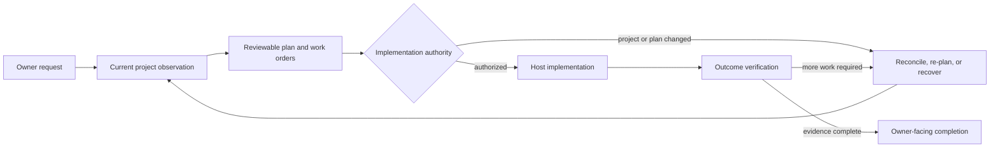

<p align="center">
  <a href="https://saroo98.github.io/loom/">
    
  </a>
</p>

<p align="center">
  <strong>Planning and verification control for AI coding agents.</strong><br>
  Turn one request into reviewable work grounded in the project as it exists now.
</p>

<p align="center">
  <a href="https://saroo98.github.io/loom/">Website</a> ·
  <a href="#quick-start">Quick start</a> ·
  <a href="#installation">Installation</a> ·
  <a href="./docs/architecture.md">Architecture</a> ·
  <a href="https://github.com/saroo98/loom/releases">Releases</a>
</p>

---

## What Loom does

Loom is a local-first control layer for AI coding agents. It observes the current project, separates
known facts from assumptions, produces a reviewable plan and bounded work orders, keeps
implementation authority explicit, and connects completion to evidence from the real work.

The owner-facing surface stays simple:

```text
/loom <request>
```

Loom keeps its planning intelligence, lifecycle state, verification records, recovery history, and
scoped owner context behind that one request.

## Why it matters

An AI coding request is only a small part of the working world. The repository may contain local
changes, project instructions, architectural constraints, unresolved decisions, and validation
that only makes sense in the real runtime.

Loom brings those signals into one lifecycle before implementation begins. The result is work that
the owner can inspect, correct, authorize, verify, recover, and complete without losing the
connection to the project state that shaped the plan.

## Principal capabilities

Loom can:

- inspect committed, staged, unstaged, untracked, ignored, generated, and owner-authorized local
  project state through bounded observation;
- distinguish facts, assumptions, unknowns, contradictions, and human decisions;
- scale planning depth with consequence, uncertainty, scope, and domain coverage;
- produce consumer-driven planning artifacts and bounded work orders;
- bind implementation authority to exact plan content and a pre-implementation baseline;
- preserve request identity across its structured host protocol;
- detect project or plan drift before stale authority can be reused;
- connect claims to declared verification evidence;
- record cancellation, recovery, retries, reversibility, and continuation state;
- keep runtime versions separate from encrypted owner state;
- keep general, domain, project, component, temporary, device, and installation memory scoped;
- build a public release from an allowlist and scan the resulting files for private material; and
- verify installation ownership, signed updates, rollback, and removal through explicit receipts.

## Current release

Loom **1.8.26** is the current signed public release.

| Item | Value |
|---|---|
| Release | [`v1.8.26`](https://github.com/saroo98/loom/releases/tag/v1.8.26) |
| Source | [`v1.8.26`](https://github.com/saroo98/loom/tree/v1.8.26) |
| Canonical plugin | [`loom-plugin-v1.8.26.zip`](https://github.com/saroo98/loom/releases/download/v1.8.26/loom-plugin-v1.8.26.zip) |
| Plugin SHA-256 | Published in the release's signed [`SHA256SUMS`](https://github.com/saroo98/loom/releases/download/v1.8.26/SHA256SUMS) |
| Licence | Apache-2.0 |
| Runtime | Python 3.10+ |

The release workflow binds source, tag, artifact, hashes, native helpers, and verification metadata
to the exact published cut.

## How a request moves through Loom


```mermaid
flowchart LR
    A["Owner request"] --> B["Current project observation"]
    B --> C["Reviewable plan and work orders"]
    C --> D{"Implementation authority"}
    D -->|project or plan changed| E["Reconcile, re-plan, or recover"]
    E --> B
    D -->|authorized| F["Host implementation"]
    F --> G["Outcome verification"]
    G -->|more work required| E
    G -->|evidence complete| H["Owner-facing completion"]
```

The key boundary is between a plan and permission to implement it. Loom lets the owner review the
proposed work first, then binds any later authority to the exact plan and project state.

### Lifecycle

1. **Observe** the project, its instructions, local state, and relevant scoped context.
2. **Plan** the artifacts and work orders needed for the requested outcome.
3. **Review and authorize** exact work against a recorded baseline.
4. **Implement** through the connected coding host.
5. **Verify** the requested outcome in its declared medium.
6. **Recover or complete** with a concrete result and one clear next action.

## What the owner receives

Depending on the request, Loom can provide:

- a bounded project snapshot and world fingerprint;
- a plan contract with dependencies, assumptions, and decisions;
- work orders with likely touch paths and acceptance checks;
- explicit implementation-authority state;
- a proof graph connecting claims to evidence;
- verification and recovery records;
- a reviewer-ready completion report and proof bundle; and
- a plain-language owner message with the result and next action.

Small tasks stay small. Loom selects only the planning artifacts needed for the decision at hand.

### Project-write boundary

Persistent planning stores bounded Loom metadata in the project’s `plans/` tree. When the owner
requests zero project writes, Loom stops before creating project-local metadata and explains the
single next action needed to continue.

## Proofline and Completion

Proofline keeps the implementation story connected from request to result:

- an intent ledger records what the owner asked for;
- a proof graph connects each completion claim to its evidence;
- scope checks compare authorized work with the final change;
- completion reports summarize outcomes, verification, recovery, and remaining owner decisions;
- trust cards present the important result in plain language; and
- proof bundles preserve reviewer-ready evidence for the exact work.

This gives developers a practical way to review not only what an agent plans to do, but what it
actually changed and how the requested outcome was checked.

## Installation

Download the signed release:

[`loom-plugin-v1.8.26.zip`](https://github.com/saroo98/loom/releases/download/v1.8.26/loom-plugin-v1.8.26.zip)

Verify its SHA-256:

```powershell
(Get-FileHash .\loom-plugin-v1.8.26.zip -Algorithm SHA256).Hash.ToLower()
```

Compare the result with the plugin entry in the release's signed
[`SHA256SUMS`](https://github.com/saroo98/loom/releases/download/v1.8.26/SHA256SUMS).

The release includes `SHA256SUMS`, `RELEASE-SUBJECT.json`, signature metadata, and installation
instructions. Continue with the [start guide](./docs/start.md).

### Source checkout

Developers working directly from source can verify the checkout before using the repository tools:

```powershell
git clone https://github.com/saroo98/loom.git
cd loom
python -B tools/loom_release.py verify . --source-classification public-release
```

## Quick start

Open a project in your coding agent and ask:

```text
/loom <request>
```

For example, ask Loom to plan a health-check endpoint for the current project. Review the proposed
work, likely touch paths, assumptions, authority state, and completion checks. When the plan
matches your intent, continue through the connected host.

## Local-first privacy

Loom sends no Loom telemetry. Owner memory, preferences, outcomes, and device state remain in the
encrypted local owner vault. Public release construction uses an allowlist and scans the exact cut
for private material before publication.

Read [`PRIVACY.md`](./PRIVACY.md) for the complete data boundary.

## Architecture

| Area | Responsibility |
|---|---|
| Stable launcher and bootstrap | Select and verify the active runtime while keeping owner state separate |
| Project inspection | Freeze the current target, instructions, changes, lifecycle, and relevant scoped context |
| Planning intelligence | Route consequence and domain coverage, select artifacts, and construct the plan contract |
| Authority and orchestration | Seal exact work, enforce continuation rules, and keep planning distinct from execution |
| Proofline and completion | Bind intent, changes, claims, evidence, reviewer outputs, and owner-facing completion |
| Verification and recovery | Record validation, failure, cleanup, quarantine, rollback, and recovery |
| Owner vault and scoped state | Preserve encrypted state, selection boundaries, transfer, merge, and forgetting |
| Host adapters | Translate host surfaces into one bounded local protocol |
| Release boundary | Build, scan, inventory, sign, verify, update, roll back, and uninstall exact artifacts |

See [`docs/architecture.md`](./docs/architecture.md) for the detailed contract map.

## Repository structure

| Path | Contents |
|---|---|
| `loom/` | Shipped planning, verification, memory, and host-facing instructions |
| `tools/` | Runtime, lifecycle, release, evaluation, and test modules |
| `scripts/` | Stable bootstrap and installed entry points |
| `schemas/` | Persisted and exchanged JSON contracts |
| `contracts/` | Versioned policy and fact contracts |
| `templates/` | Planning and lifecycle artifact templates |
| `docs/` | GitHub Pages site, architecture, start guide, and generated technical evidence |
| `vault-helper/` | Native encrypted-vault helper and its Rust tests |
| `.github/workflows/` | Pull-request, compatibility, Pages, and release workflows |

## Development

1. Create an isolated branch and worktree from the intended base.
2. Use disposable homes, runtime directories, vaults, and installation targets in tests.
3. Make the smallest coherent change for the relevant contract.
4. Run focused tests for changed behavior before wider gates.
5. Regenerate committed evidence only through repository tools.
6. Review the exact diff, privacy boundary, compatibility, and recovery path.
7. Treat release promotion as a separate operation bound to exact-main evidence.

Useful bounded checks:

```powershell
python -B tools/loom_test.py fast --max-seconds 30 --output fast-test-timings.json
python -B tools/loom_docs.py generate --root .
python -B tools/loom_readiness.py . --check
python -B tools/loom_version.py .
```

## Contributing

Read [`CONTRIBUTING.md`](./CONTRIBUTING.md). Contributions must preserve local-first privacy, least
authority, explicit evidence classes, compatibility, and recoverable lifecycle behavior.

## Licence

Loom is licensed under the [Apache License 2.0](./LICENSE).

---

<p align="center">
  <strong>Plan from the current world. Verify in the real one.</strong><br>
  Local-first · no Loom telemetry · Python 3.10+ · Apache-2.0
</p>
