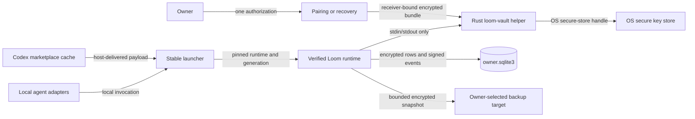

# Loom security definitions

This document freezes Loom's security boundary before the owner-vault runtime is activated. It is
a living engineering artifact, not a certification. A fully compromised operating-system account
or an unrestricted hostile agent already authorized to execute arbitrary host commands is outside
Loom's enforceable boundary. Loom still minimizes persistence and blast radius in that condition,
but it does not claim confidentiality from the account that is actively decrypting the vault.

## Trust boundaries and data flow

Marketplace delivery crosses a distribution trust boundary. Agent adapters cross an execution
boundary. The Rust helper is the only component permitted to receive unwrapped cryptographic key
material. Backup media and paired-device transport are untrusted storage and transport.

On a fresh installation, the Codex marketplace and host are the initial delivery trust anchor. A
verifier delivered inside that same package cannot prove the package was non-malicious before it
runs. Loom therefore claims internal consistency and corruption detection at first install, not
independence from a malicious marketplace bootstrap. Every later update is verified as passive
data by the already-installed stable launcher before any new Python or native code executes.

Trusted-root rotation is sequential. A candidate root advances exactly one version and its one
transition envelope must satisfy the old root threshold and the new root threshold. Old-only,
new-only, skipped, expired, and rolled-back transitions fail closed.

## SD1: hostile or stale update replaces the runtime

**Criticality:** Critical

### Threat Model

- An attacker can control a mirror, replay old metadata, copy a plugin-cache directory, substitute
  same-named files, or interrupt staging and activation.
- The attacker cannot produce threshold-authorized root metadata or a valid target hash under a
  non-compromised release root.

### Security Goal

- No unlisted, expired, lower-sequence, wrong-platform, mixed-version, or hash-mismatched payload
  can become active. Activation is atomic and never changes an active session.
- **Rationale:** Enforces P05 and P06; protects the runtime and owner vault; violation could execute
  attacker code with the owner's agent authority or corrupt learned state.

### Accepted Goal Status

- Source-level hostile regressions now cover staged receipts, copied-cache substitution, ordinary
  crash rollback, and sequential threshold rotation. The goal remains **not met for release** until
  the exact canonical artifact passes every native platform gate.

## SD2: migration loses, widens, or resurrects owner learning

**Criticality:** Critical

### Threat Model

- Legacy state may be corrupted, oversized, interrupted, duplicated, installation-scoped, or
  contain an earlier copy of information the owner later forgot.
- The attacker cannot alter the read-only source after its source hashes and stable read are
  completed without detection.

### Security Goal

- Migration cannot delete a semantic record, widen scope, activate ambiguous text, lose
  provenance, or resurrect a tombstoned statement without a receipt that blocks activation.
- **Rationale:** Enforces P05 and P06; protects preferences, calibration, project isolation, and
  forgetting; violation could mislead future plans or restore information the owner removed.

### Accepted Goal Status

- Goal is **not met** until sanitized 0.8 and 1.0 fixtures migrate idempotently, reconcile exactly,
  and survive rollback and interruption tests.

## SD3: another device replays or contaminates learning

**Criticality:** High

### Threat Model

- A previously paired or revoked device can replay a signed old bundle, reorder events, duplicate
  operations, send an unknown schema, or submit concurrent contradictory preferences.
- It cannot sign as a different non-compromised device or decrypt a rotated future vault key.

### Security Goal

- Counters, signature chains, membership, release sequence, forgetting epochs, project lineage,
  and entity-specific merge rules prevent replay and cross-scope activation; ambiguity is
  quarantined rather than selected.
- **Rationale:** Enforces P05 and P06; protects owner intent and scoped learning; violation could
  silently apply stale or wrong-domain guidance.

### Accepted Goal Status

- Deterministic source-level delivery-order, duplicate, replay, stale-device, and revoked-device
  simulations now converge or fail closed. Native multi-device artifact evidence remains required.

## SD4: passive visibility leaks owner data

**Criticality:** High

### Threat Model

- A **Passive Observer** can read plugin packages, marketplace metadata, backup media, transfer
  media, logs, process arguments, and normal agent output without acting maliciously.
- The observer does not control the unlocked Loom process or OS secure key store.

### Security Goal

- Owner statements, preferences, project metadata, evidence metadata, private rules, and event
  payloads remain encrypted at rest and never enter plugin assets, logs, argv, environment
  variables, or default health output.
- **Rationale:** Enforces P01 and P05; protects private owner learning; violation could disclose
  personal or project information through normal distribution or support workflows.

### Accepted Goal Status

- Goal is **partially met**: the 1.0 public firewall and no-telemetry audit are mechanical. Full
  vault encryption, stdin-only helper handoff, binary-package scanning, and recovery probes remain
  required before release activation.

## SD5: hostile adapter causes split-brain execution

**Criticality:** High

### Threat Model

- An unowned repo-local or user-local adapter can shadow the global Loom name, invoke a stale
  engine, or point at a version-specific plugin cache.
- It cannot forge Loom's ownership receipt for an unchanged adapter file.

### Security Goal

- Every supported adapter invokes the stable launcher; unowned conflicts block with a split-brain
  receipt; uninstall or upgrade changes only receipt-proven Loom-owned files.
- **Rationale:** Enforces P05; protects runtime coherence and project isolation; violation could run
  stale logic against current state or expose one project to another instance.

### Accepted Goal Status

- Goal is **not met** until adapter installation, conflict, backup, uninstall, and disposable real
  invocation tests pass for every claimed host.

## STRIDE threat catalog

| Threat | STRIDE | Required mitigation | Activation evidence |
|---|---|---|---|
| Forged or rolled-back runtime | Spoofing, Tampering | threshold metadata, sequence floor, target hashes | hostile updater tests |
| Interrupted migration | Tampering, Denial of Service | online snapshot, idempotent ledger, atomic pointers | crash-injection matrix |
| Replayed device history | Spoofing, Repudiation | device signatures, counters, prior hashes, revocation epoch | convergence simulations |
| Owner data in package or logs | Information Disclosure | encryption, stdin handoff, all-file firewall | exact-artifact privacy scan |
| Adapter shadowing | Elevation of Privilege | ownership receipts and split-brain refusal | multi-agent adapter suite |

## Accepted Goal Status policy

No status becomes "met" from source inspection. It requires the named behavior test against the
exact artifact. Independent cryptographic review and hostile systems review remain external gates.

## Phase 3 unknown-domain threats

| Threat | Required fail-closed behavior | Mechanical evidence |
|---|---|---|
| Confident wrong-domain route | preserve ambiguity; host proposal cannot activate memory | route-v2 contract and routing tests |
| Hidden multi-domain boundary | every material subsystem is known or explicitly blocked | composition graph and branch-closure tests |
| Source-authority spoofing | source self-claims and URL shape mint no authority | source-class policy and hostile evidence tests |
| Wrong jurisdiction/product/version | exact-target applicability receipt is required | bundle target and applicability tests |
| Stale or superseded evidence | claim-specific currentness blocks and re-gates | time-gap freshness tests |
| Prompt or tool-description injection | retrieved instructions remain inert data | host-source injection tests |
| Fabricated/circular sources | content IDs and duplicate-content rejection | bundle inventory tests |
| Owner assertion as external authority | owner authority is a separate class | authority-policy tests |
| Conflict suppression | supporting and contradicting edges cannot be gate-ready together | conflict validation tests |
| Semantic mutation under reused ID | canonical digest mismatch blocks completion | mutation tests |
| Cross-project/domain contamination | exact scope predicate and bounded encrypted views | 100,000 scope traces and vault tests |
| Unbounded discovery/state | hard question/source/invariant/event/materializer limits | bound tests |
| Offline expiry | expired required evidence remains blocked | offline freshness test |
| Markdown/machine divergence | projection IDs/digests must equal the sealed bundle | lint and orchestrator tests |
